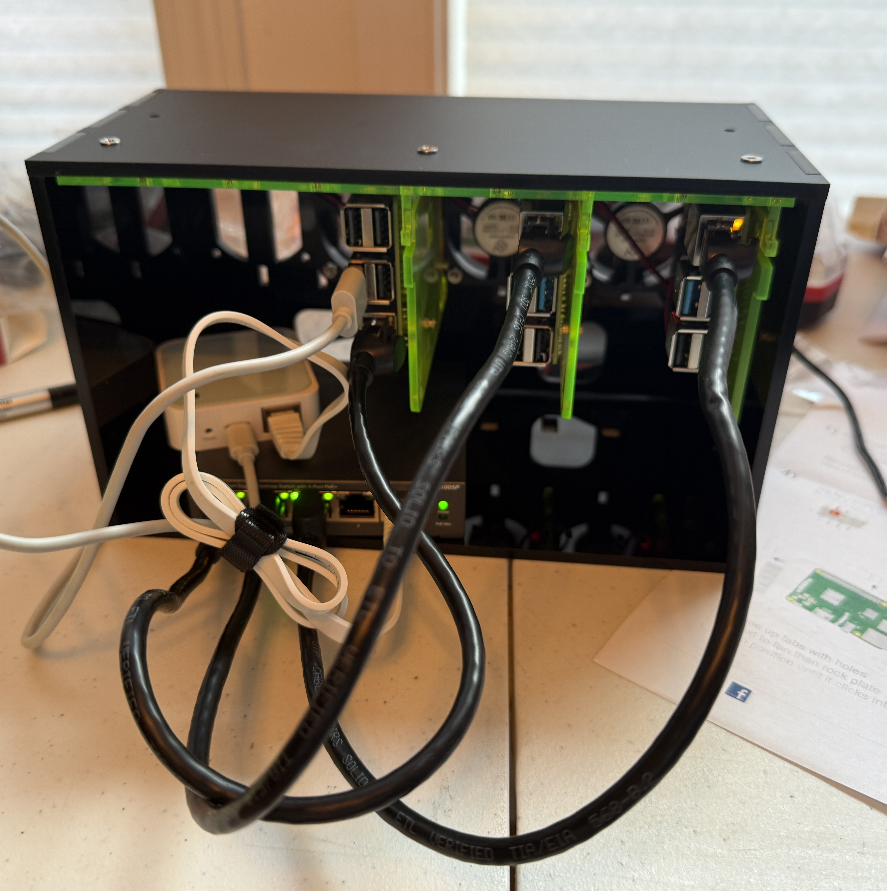

# Alex Norum's Personal Website

This repository contains the source code for Alex Norum's personal website - a modern, interactive portfolio showcasing professional experience, skills, and personal interests with a unique RPG-inspired theme option.



## 🚀 Features

- **Dual Theme System**: Standard professional theme and a unique RPG-inspired theme
- **Interactive Sections**: Work experience timeline, skills showcase, and personal interests
- **Data Visualizations**: Travel map, reading stats, golf stats, and fitness tracking
- **Mara AI Assistant**: Integrated AI chatbot for site interaction
- **Server-Side Rendering**: Built with Astro's SSR capabilities for optimal performance

## 🛠️ Technologies

- **Frontend**: [Astro](https://astro.build/) with [React](https://reactjs.org/) components
- **Styling**: CSS with [Tailwind CSS](https://tailwindcss.com/)
- **Maps**: [Leaflet](https://leafletjs.com/) for interactive travel maps
- **Charts**: [Recharts](https://recharts.org/) and [ApexCharts](https://apexcharts.com/) for data visualization
- **Deployment**: Docker and Kubernetes ready

## 🧞 Local Development

All commands are run from the root of the project:

| Command                   | Action                                           |
| :------------------------ | :----------------------------------------------- |
| `npm install`             | Installs dependencies                            |
| `npm run dev`             | Starts local dev server at `localhost:4321`      |
| `npm run build`           | Build your production site to `./dist/`          |
| `npm run preview`         | Preview your build locally, before deploying     |

## 🐳 Docker Deployment

This project is containerized for easy deployment. The Docker setup uses a multi-stage build process with Node.js for SSR (Server-Side Rendering).

### Building the Docker Image

```bash
# Build the Docker image
docker build -t alex-website:latest .

# Run the container locally
docker run -p 4321:4321 alex-website:latest
```

### Using the Deployment Script

A deployment script is included to build and push the image to GitHub Container Registry:

```bash
./deploy.sh --username anorum --version v1.0.0
```

## ☸️ Kubernetes Deployment

Kubernetes manifests are provided in the `kubernetes/` directory for deploying to a Kubernetes cluster:

1. **Apply the deployment**:
   ```bash
   kubectl apply -f kubernetes/deployment.yaml
   kubectl apply -f kubernetes/ingress.yaml
   ```

2. **Access the application** through the configured Ingress resource.

For detailed deployment instructions, see the [Kubernetes README](kubernetes/README.md).

## 📁 Project Structure

```
/
├── public/               # Static assets
│   ├── data/             # Data files for stats
│   └── images/           # Image assets
├── src/
│   ├── assets/           # Source assets
│   ├── components/       # UI components
│   │   ├── rpg/          # RPG theme components
│   │   ├── travel/       # Travel visualization components
│   │   └── ...           # Other component categories
│   ├── layouts/          # Page layouts
│   ├── pages/            # Page components
│   ├── styles/           # CSS styles
│   └── utils/            # Utility functions
├── kubernetes/           # Kubernetes deployment manifests
├── Dockerfile            # Docker configuration
└── astro.config.mjs      # Astro configuration
```

## 🔄 Environment Variables

The application uses environment variables for configuration. In production, these are provided through Kubernetes ConfigMaps:

- `ALEX_API_KEY`: API key for data access
- `API_BASE_URL`: Base URL for API endpoints
- `MARABOT_URL`: URL for the Chainlit Mara bot service (defaults to http://localhost:8000 in development)

## 📝 License

This project is personal and not open for general use or redistribution without permission.

## 👤 About the Author

Alex Norum is a Data Platform Engineer based in Portland, OR. This website showcases his professional experience, skills, and personal interests.
